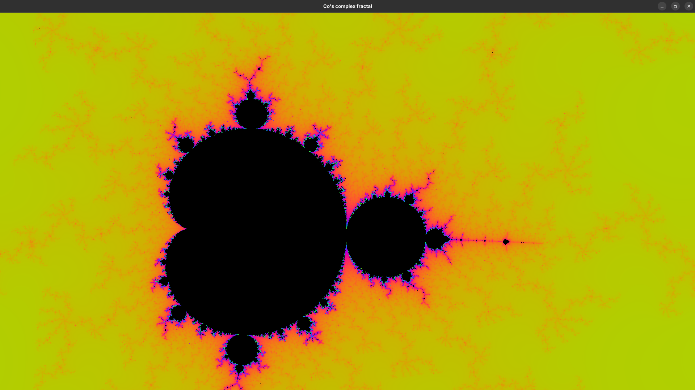
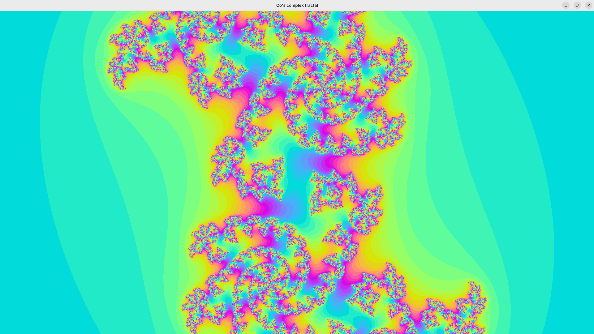

# README

This is a little project, where I am drawing some complexes fractals, using the rust crate glium

## Instructions 

- To change the drawed set press `J` => Julia, `M` => Mandelbrot.
- Use `wasd` to move the start point.
- Use the arrows to move the center.
- Use `shift` and `ctrl` to zoom.
- Use `+` and `-` to change the color palette offset.
- Press 0 to reset to default.
- Press h to see infos.

## Exemples

### Mandelbrot

### Julia

